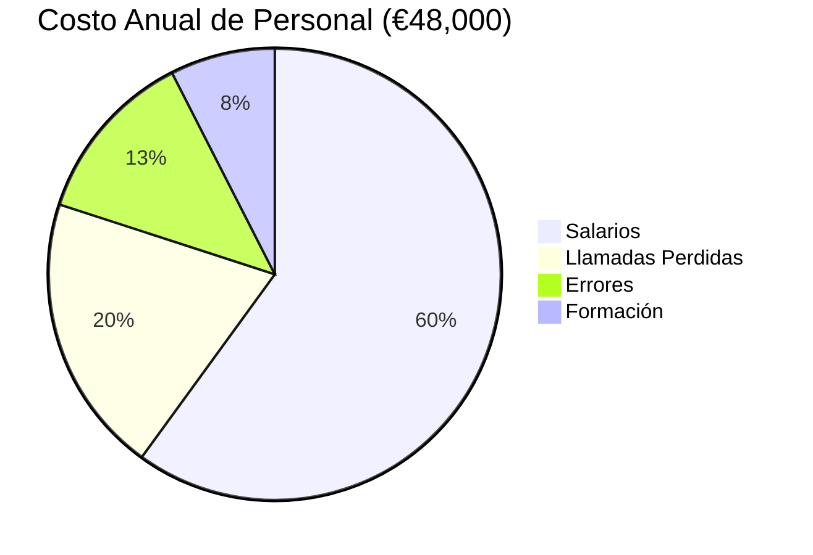
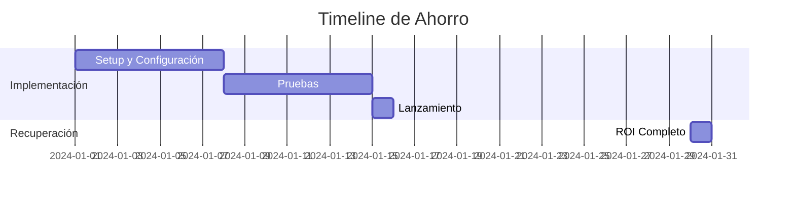
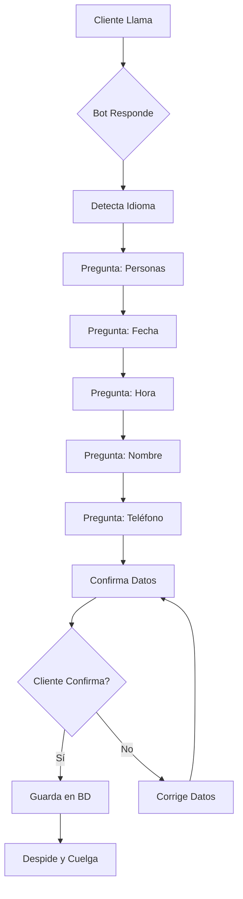
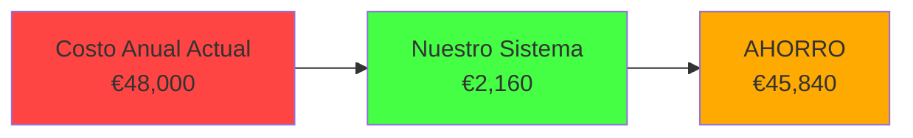
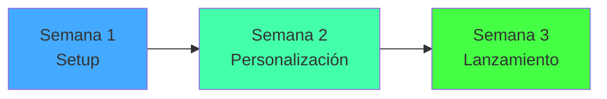
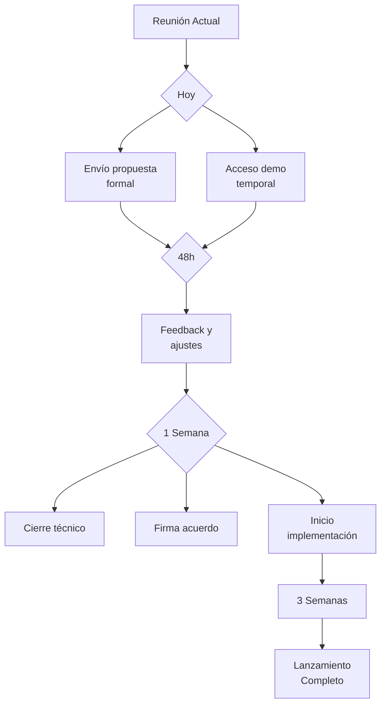

# 🚀 PRESENTACIÓN VISUAL - Sistema de Reservas Inteligente

> **Material de apoyo para reuniones de ventas**
> Proyectar en pantalla o usar como referencia visual

---

## SLIDE 1: PORTADA

```
╔═══════════════════════════════════════════════════════════╗
║                                                           ║
║           🤖 SISTEMA DE RESERVAS INTELIGENTE              ║
║                                                           ║
║        Automatice su gestión de reservas 24/7            ║
║                                                           ║
║              Ahorre €45,840/año                          ║
║              ROI en 2 semanas                           ║
║                                                           ║
║              Equipo CronosAI                             ║
║              Diciembre 2024                              ║
║                                                           ║
╚═══════════════════════════════════════════════════════════╝
```

---

## SLIDE 2: EL PROBLEMA ACTUAL

### 💸 SU SITUACIÓN AHORA

```
┌────────────────────────────────────────────────────┐
│                                                    │
│  ❌ Costo Mensual: €4,000                         │
│  ❌ Atiende solo 70% de llamadas                  │
│  ❌ Errores humanos: 5-10%                        │
│  ❌ Sin servicio 24/7                             │
│  ❌ Personal ocupado en tareas rutinarias         │
│  ❌ Pérdida de clientes potenciales               │
│                                                    │
└────────────────────────────────────────────────────┘
```

### 🎯 DÓNDE SE VA SU DINERO



---

## SLIDE 3: LA SOLUCIÓN

### ✅ CON NUESTRO SISTEMA

```
┌────────────────────────────────────────────────────┐
│                                                    │
│  ✅ Atiende 100% de llamadas                      │
│  ✅ Disponible 24/7/365                           │
│  ✅ 6 idiomas incluidos                           │
│  ✅ Errores: <1%                                  │
│  ✅ Costo: €180/mes                               │
│  ✅ Personal libre para atención                  │
│  ✅ Conversación natural y fluida                 │
│                                                    │
└────────────────────────────────────────────────────┘
```

---

## SLIDE 4: AHORRO REAL

### 💰 COMPARACIÓN DIRECTA

```
╔═══════════════════════════════════════════╗
║                                           ║
║   ANTES          →  AHORA                 ║
║                                           ║
║   €4,000/mes     →  €180/mes              ║
║   €48,000/año    →  €2,160/año            ║
║                                           ║
║   ═════════════════════════════           ║
║                                           ║
║   💰 AHORRO ANUAL: €45,840                ║
║   📊 REDUCCIÓN: 95.5%                     ║
║   ⏱️  ROI: 2 semanas                      ║
║                                           ║
╚═══════════════════════════════════════════╝
```

### 📈 PROYECCIÓN DE AHORRO



---

## SLIDE 5: CARACTERÍSTICAS PRINCIPALES

### 🎯 LO QUE OFRECEMOS

```
┌─────────────────────────────────────────────────┐
│                                                 │
│  🌍 MULTI-IDIOMA (6 idiomas)                   │
│     ES, EN, DE, IT, FR, PT                     │
│                                                 │
│  🎤 VOZ NATURAL (Google Neural2)               │
│     Indistinguible de humano                   │
│                                                 │
│  🧠 CONVERSACIÓN INTELIGENTE                   │
│     25+ variaciones por mensaje                │
│                                                 │
│  🔄 GESTIÓN COMPLETA                           │
│     Crear, Modificar, Cancelar                 │
│                                                 │
│  📊 INTEGRACIÓN TOTAL                          │
│     MySQL, Logs, Monitoreo                     │
│                                                 │
└─────────────────────────────────────────────────┘
```

---

## SLIDE 6: MULTI-IDIOMA EN ACCIÓN

### 🌍 DETECCIÓN AUTOMÁTICA

```
                        ┌──────────────┐
                        │   LLAMADA    │
                        └──────┬───────┘
                               │
                      ┌────────▼────────┐
                      │ DETECTA IDIOMA  │
                      └────────┬────────┘
                               │
        ┌──────────────────────┼──────────────────────┐
        │                      │                      │
   ┌────▼─────┐         ┌──────▼────┐         ┌──────▼────┐
   │ ESPAÑOL  │         │ INGLÉS    │         │ ALEMÁN    │
   │          │         │           │         │           │
   │ Hola!... │         │ Hello!... │         │ Hallo!... │
   └──────────┘         └───────────┘         └───────────┘
```

---

## SLIDE 7: FLUJO DE FUNCIONAMIENTO

### 📞 PROCESO COMPLETO



**⏱️ Tiempo: 90-150 segundos**

---

## SLIDE 8: CASOS DE USO

### ✅ RESERVA ESTÁNDAR

```
[BOT]  ¡Hola! Bienvenido a nuestro restaurante
       ¿En qué puedo ayudarle?

[USER] Quiero reservar una mesa

[BOT]  Perfecto, para cuántas personas?

[USER] Somos 4 personas

[BOT]  Excelente, mesa para 4 personas
       ¿Para qué fecha quiere reservar?

[USER] Mañana a las 8

[BOT]  Perfecto, mañana a las 20:00...
       
       ✅ RESERVA COMPLETA
```

---

## SLIDE 9: MODIFICACIÓN EN VIVO

### ✏️ CAMBIO DE RESERVA

```
[USER] Quiero cambiar la hora de mi reserva

[BOT]  Encontré su reserva para 4 personas
       mañana a las 20:00. ¿Qué quiere cambiar?

[USER] La hora, quiero las 21:00

[BOT]  Perfecto, cambio la hora de 20:00 a 21:00
       ¿Confirma el cambio?

[USER] Sí

[BOT]  ✅ Reserva actualizada

       ✅ CAMBIO COMPLETO
```

---

## SLIDE 10: COMPARACIÓN TÉCNICA

### 🆚 VS OTROS SISTEMAS

```
┌──────────────────┬──────────┬──────────┬─────────┐
│ Característica   │ Nosotros │ Compet.  │  IVR    │
├──────────────────┼──────────┼──────────┼─────────┤
│ Conversación     │ Natural  │ Robótica │ Robótica│
│ Multi-idioma     │ 6 idiomas│ Limitado │  No     │
│ Velocidad        │  <1s     │   3-5s   │  5-10s  │
│ Precisión        │   98%+   │   85%    │   70%   │
│ Modificar        │   ✅ Sí  │   ❌ No  │  ❌ No  │
│ Cancelar         │   ✅ Sí  │   ❌ No  │  ❌ No  │
│ Costo/mes        │   €180   │   €500+  │  €350   │
└──────────────────┴──────────┴──────────┴─────────┘
```

---

## SLIDE 11: COMPARACIÓN DE COSTOS

### 💵 DESGLOSE DETALLADO



---

## SLIDE 12: ARQUITECTURA TÉCNICA

### 🏗️ CÓMO FUNCIONA

```
        ┌─────────────┐
        │   Cliente   │
        │   Llama     │
        └──────┬──────┘
               │
               ▼
        ┌─────────────┐
        │   TWILIO    │ ← Speech-to-Text
        │  Voice API  │
        └──────┬──────┘
               │
               ▼
        ┌─────────────┐
        │   NUESTRO   │
        │  PROCESADOR │ ← Lógica Inteligente
        └──────┬──────┘
               │
        ┌──────┴──────┐
        │             │
        ▼             ▼
   ┌─────────┐  ┌────────────┐
   │ MySQL   │  │  Google    │ ← Text-to-Speech
   │  BD     │  │  Neural2   │    Natural Voice
   └─────────┘  └────────────┘
```

---

## SLIDE 13: CASOS DE ÉXITO

### 🏆 RESTAURANTE MADRID CENTRO

```
Situación Inicial:
├─ 150 reservas/semana
├─ 2 recepcionistas
├─ €3,200/mes
└─ 30% llamadas perdidas

                    ⬇️ IMPLEMENTACIÓN ⬇️

Después:
├─ 100% reservas atendidas
├─ €183/mes
├─ Ahorro: €3,017 (94%)
└─ ROI: 2 semanas

"Personal ahora se enfoca en atención
 en sala, donde realmente importa"
                    - Gerente
```

---

## SLIDE 14: VENTAJAS COMPETITIVAS

### 🚀 POR QUÉ ELEGIRNOS

```
┌───────────────────────────────────────┐
│                                       │
│  ✅ NO es experimento                 │
│     - 7.206 líneas probadas          │
│     - 99.97% uptime                   │
│                                       │
│  ✅ SOPORTE REAL                      │
│     - Teléfono directo                │
│     - Respuesta <2h                   │
│                                       │
│  ✅ TRANSPARENCIA                     │
│     - Código auditado                 │
│     - Precios claros                  │
│                                       │
│  ✅ PERSONALIZACIÓN                   │
│     - Adaptado a SU restaurante      │
│     - Integración completa            │
│                                       │
└───────────────────────────────────────┘
```

---

## SLIDE 15: PLANES Y PRECIOS

### 💼 3 OPCIONES

```
┌────────────────────────────────────────────┐
│                                            │
│  📦 PLAN BÁSICO: €180/mes                 │
│     ✅ Reservas 24/7                       │
│     ✅ 6 idiomas                           │
│     ✅ Modificar/Cancelar                  │
│     ✅ Soporte técnico                     │
│                                            │
│  🚀 PLAN PRO: €330/mes                    │
│     ✅ Todo lo anterior +                  │
│     ✅ SMS confirmación                    │
│     ✅ Dashboard web                       │
│     ✅ Análisis avanzado                   │
│                                            │
│  💼 ENTERPRISE: Personalizado             │
│     ✅ Todo lo anterior +                  │
│     ✅ Desarrollo a medida                 │
│     ✅ Múltiples números                   │
│     ✅ Soporte dedicado                    │
│                                            │
└────────────────────────────────────────────┘
```

---

## SLIDE 16: IMPLEMENTACIÓN

### 📅 ROADMAP



### ✅ FASES DETALLADAS

**Semana 1: Configuración**
- Setup número Twilio
- Conexión a BD
- Webhooks configurados

**Semana 2: Personalización**
- Adaptación mensajes
- Pruebas con casos reales
- Ajustes finos

**Semana 3: Lanzamiento**
- Activación producción
- Monitoreo intensivo
- Entrega completa

---

## SLIDE 17: GARANTÍAS

### 🛡️ NUESTROS COMPROMISOS

```
┌────────────────────────────────────────────┐
│                                            │
│  ✅ Entrega en 3 semanas                   │
│     o devolución de depósito              │
│                                            │
│  ✅ Uptime 99.9%                           │
│     o crédito de servicio                 │
│                                            │
│  ✅ Soporte 24/7                           │
│     emergencias críticas                   │
│                                            │
│  ✅ Actualizaciones gratis                 │
│     durante 12 meses                       │
│                                            │
│  ✅ Si no funciona                         │
│     devolvemos su dinero (30 días)         │
│                                            │
└────────────────────────────────────────────┘
```

---

## SLIDE 18: TENDENCIAS DEL MERCADO

### 🎯 POR QUÉ ES EL MOMENTO

```
📈 ESCASEZ DE PERSONAL
   └─ Dificultad para contratar
   └─ Alta rotación
   └─ Salarios al alza

🌍 EXPECTATIVAS DEL CLIENTE
   └─ Servicio 24/7 esperado
   └─ Atención instantánea
   └─ Multi-idioma

💻 TECNOLOGÍA MADURA
   └─ 95%+ precisión STT
   └─ Voces indistinguibles
   └─ Cloud confiable

🏆 VENTAJA COMPETITIVA
   └─ Pocos tienen esto
   └─ Posicionamiento premium
   └─ Imagen de innovación
```

---

## SLIDE 19: RESPUESTA A OBJECIONES

### 💬 "El robot no sonará natural"

```
❌ MIEDO: Sonará robótico y frío

✅ REALIDAD:
   - Google Neural2 tecnología
   - Voces indistinguibles
   - 25+ variaciones naturales
   - Demo en vivo para probar

📞 PRUEBA: "Voy a llamar ahora"
```

---

### 💬 "Los clientes prefieren personas"

```
❌ MIEDO: Clientes rechazarán el sistema

✅ REALIDAD:
   - 67% prefieren automático si es rápido
   - Respuesta en 1 segundo
   - Disponible 24/7
   - Sin esperas ni errores

📊 DATOS: Mejor experiencia ≠ humano
```

---

### 💬 "Es muy caro para empezar"

```
❌ MIEDO: No podemos invertir tanto

✅ REALIDAD:
   - Ahorra €3,820/mes
   - ROI en 2 semanas
   - Libera personal para tareas importantes
   - Genera ingresos adicionales

💰 CÁLCULO: €180 vs €4,000 mensual
```

---

## SLIDE 20: DEMO EN VIVO

### 📞 LO QUE VAMOS A MOSTRAR

```
1️⃣  LLAMADA REAL
    └─ Conversación natural
    └─ Confirmación de datos

2️⃣  CAMBIO DE IDIOMA
    └─ Detección automática
    └─ Continuidad perfecta

3️⃣  MODIFICACIÓN
    └─ Cambio en vivo
    └─ Confirmación

4️⃣  BASE DE DATOS
    └─ Ver reservas guardadas
    └─ Historial completo

5️⃣  MÉTRICAS
    └─ Estadísticas tiempo real
    └─ Logs detallados

⏱️  Duración: 15 minutos
```

---

## SLIDE 21: CIERRE

### 🎯 MENSAJE FINAL

```
╔═══════════════════════════════════════════════╗
║                                               ║
║    "No estamos vendiendo tecnología"          ║
║                                               ║
║    "Estamos vendiendo:"                       ║
║                                               ║
║    ⏰  TIEMPO  - Para sus clientes            ║
║    💰  DINERO  - Para su negocio             ║
║    😌  CALMA   - Para usted                  ║
║                                               ║
║    El sistema trabaja 24/7                   ║
║    Usted se concentra en lo importante       ║
║                                               ║
║    📅  ROI en 2 semanas                       ║
║    💼  Garantía satisfacción                  ║
║    🤝  Demo gratis 1 semana                  ║
║                                               ║
╚═══════════════════════════════════════════════╝
```

---

## SLIDE 22: PRÓXIMOS PASOS

### ✅ LO QUE SIGUE



---

## SLIDE 23: CONTACTO

### 📞 SIGAMOS EN CONTACTO

```
╔════════════════════════════════════════╗
║                                        ║
║  📧  contacto@cronosai.com             ║
║  📱  +34 XXX XXX XXX                   ║
║  🌐  www.cronosai.com                  ║
║                                        ║
║  Estamos disponibles para:             ║
║  • Aclarar dudas                       ║
║  • Demo adicional                      ║
║  • Material personalizado              ║
║  • Lo que necesite                     ║
║                                        ║
╚════════════════════════════════════════╝
```

---

## SLIDE 24: PREGUNTAS

### ❓ ¿TENEMOS DUDAS?

```
╔═══════════════════════════════════════════════╗
║                                               ║
║         ???????? DUDAS ?????????               ║
║                                               ║
║  Estamos aquí para responder:                 ║
║                                               ║
║  • ¿Cómo funciona técnicamente?               ║
║  • ¿Y si necesitamos cambios?                 ║
║  • ¿Qué pasa con nuestros datos?              ║
║  • ¿Funciona con nuestro sistema?             ║
║  • ¿Cuándo podemos empezar?                   ║
║                                               ║
║  TODO tiene respuesta                         ║
║                                               ║
╚═══════════════════════════════════════════════╝
```

---

## SLIDE 25: CTA FINAL

### 🚀 LLAMADA A LA ACCIÓN

```
╔════════════════════════════════════════════════╗
║                                                ║
║       La pregunta NO es si lo necesitan        ║
║                                                ║
║                (obviamente sí)                 ║
║                                                ║
║    La pregunta es: ¿Cuándo quieren empezar     ║
║              a ahorrar ese dinero?             ║
║                                                ║
║    ━━━━━━━━━━━━━━━━━━━━━━━━━━━━━━━━━━━━━━    ║
║                                                ║
║       🤝 DEMO GRATIS 1 SEMANA                  ║
║                                                ║
║       Si les gusta → continuamos              ║
║       Si no      → nos despedimos             ║
║                                                ║
║    ━━━━━━━━━━━━━━━━━━━━━━━━━━━━━━━━━━━━━━    ║
║                                                ║
║          ¿Avanzamos con el pilot?              ║
║                                                ║
╚════════════════════════════════════════════════╝
```

---

## NOTAS PARA LA PRESENTACIÓN

### ⏱️ TIMING RECOMENDADO

- **Slides 1-4**: Problema y solución (5 min)
- **Slides 5-9**: Características y demos (8 min)
- **Slides 10-14**: Comparación y casos (5 min)
- **Slides 15-19**: Planes y objeciones (7 min)
- **Slide 20**: Demo en vivo (15 min)
- **Slides 21-25**: Cierre y preguntas (10 min)

**Total: ~50 minutos + Q&A**

---

### 🎯 CONSEJOS DE PRESENTACIÓN

1. **Slides 1-5**: Velocidad normal, establece contexto
2. **Slides 6-9**: Más lento, explica detalles
3. **Slide 20**: ¡DEMO! No tengas prisa
4. **Slides 21-25**: Energía alta, cierre fuerte
5. **Q&A**: Paciencia, tranquilidad, claridad

---

### 📊 DIAGRAMAS MERMAID

Los diagramas Mermaid pueden mostrarse en:
- [GitHub](https://github.blog/2022-02-14-include-diagrams-markdown-files-mermaid/)
- [Mermaid Live Editor](https://mermaid.live)
- Visual Studio Code (con extensión Mermaid)
- Notion, Confluence, etc.

Para presentación con PowerPoint:
- Capturar screenshots de mermaid.live
- Importar como imágenes

---

### 🖼️ USO EN DIFERENTES FORMATOS

**Markdown (esto):**
- Leer en pantalla
- Usar como guía
- Exportar a PDF

**PowerPoint:**
- Convertir cada slide a diapositiva
- Añadir animaciones
- Exportar imágenes Mermaid

**PDF:**
- Usar para enviar después
- Material de referencia
- Propuesta formal

---

**¡ÉXITO EN TU REUNIÓN!** 🚀🎯

